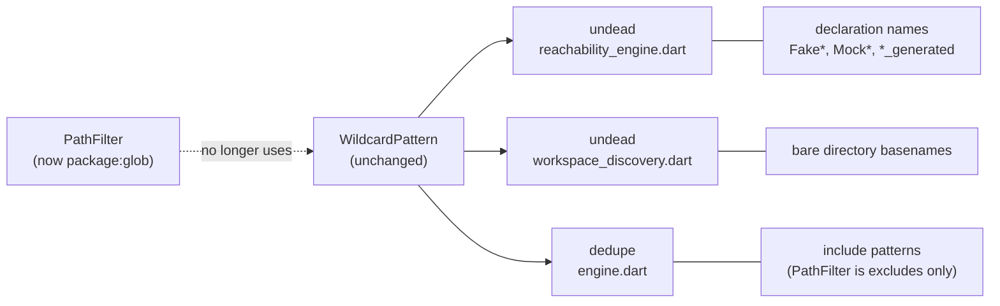
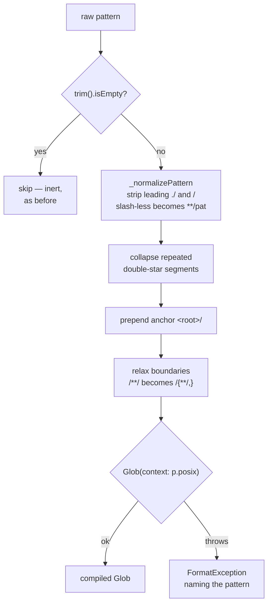
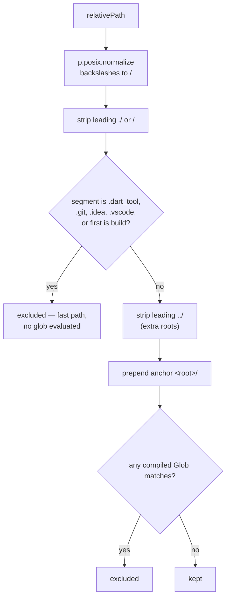
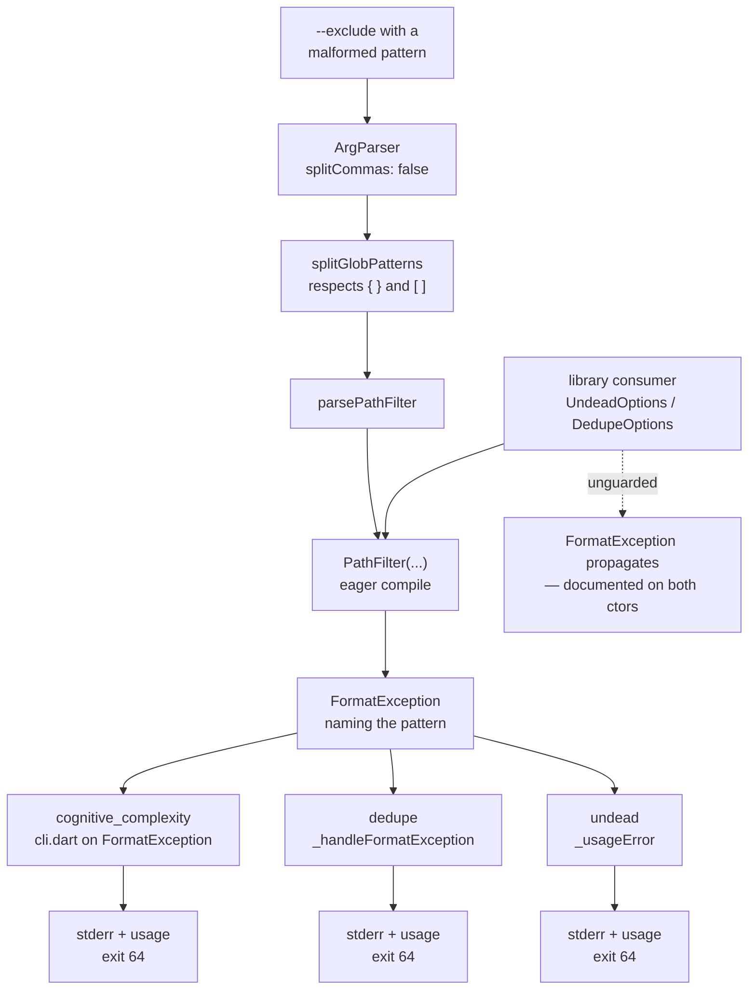

# PathFilter design

Reference for `PathFilter` after the move to `package:glob`. Covers the public
API surface, the two transformation pipelines, and where a bad pattern becomes
visible.

> [!NOTE]
> Exclusion is **not opt-in**. `PathFilter.defaults` compiles 15 patterns —
> 5 ignored directories plus 10 generated-file patterns — and applies them to
> every scanned file before any `--exclude` is supplied. A regression here
> changes the output of `cognitive_complexity`, `dedupe` and `undead` at once.

## API surface

<!-- mdformat off(prevent table wrapping) -->

| Symbol | Kind | Exported from | Status |
| :--- | :--- | :--- | :--- |
| `PathFilter` | class | `analyzer.dart`, `analytica.dart`, `cli.dart` | Behaviour changed |
| `PathFilter.defaultIgnoredDirectories` | `static const List<String>` | as above | **Unchanged** |
| `PathFilter.defaultGeneratedPatterns` | `static const List<String>` | as above | **Unchanged** |
| `PathFilter.defaults` | `static final PathFilter` | as above | Unchanged |
| `PathFilter({excludePatterns, ignoreGenerated})` | constructor | as above | Now throws `FormatException` |
| `PathFilter.isExcluded(String)` | method | as above | Signature unchanged |
| `splitGlobPatterns(String)` | top-level function | `cli.dart`, `analytica.dart` | **New** |
| `parsePathFilter(ArgResults, {defaultExcludes})` | top-level function | as above | Splitting changed |
| `addPathFilterOptions()` | `ArgParser` extension | as above | `splitCommas: false` |
| `WildcardPattern` | class | `analyzer.dart` | **Untouched** |

<!-- mdformat on -->

`WildcardPattern` is deliberately left alone. It has three consumers that are
not `PathFilter`, one of which does not match paths at all:



`package:glob` is segment-oriented and is the wrong tool for matching Dart
identifiers, and `glob_matcher_test.dart` deliberately pins regex
metacharacters as literal. Both rule out changing `WildcardPattern` itself.

## Pipeline 1 — compiling a pattern

Runs once per pattern, eagerly, in the constructor.



Worked examples, taken from the running pipeline:

<!-- mdformat off(prevent table wrapping) -->

| Raw | After normalize | After collapse | Compiled |
| :--- | :--- | :--- | :--- |
| `**/*.g.dart` | `**/*.g.dart` | `**/*.g.dart` | `<root>/{**/,}*.g.dart` |
| `legacy_*.dart` | `**/legacy_*.dart` | `**/legacy_*.dart` | `<root>/{**/,}legacy_*.dart` |
| `build/**` | `build/**` | `build/**` | `<root>/build/**` |
| `lib/**/*.g.dart` | `lib/**/*.g.dart` | `lib/**/*.g.dart` | `<root>/lib/{**/,}*.g.dart` |
| `**/**/x.dart` | `**/**/x.dart` | `**/x.dart` | `<root>/{**/,}x.dart` |
| `/custom/**` | `custom/**` | `custom/**` | `<root>/custom/**` |

<!-- mdformat on -->

### Why the anchor exists

`package:glob` has no way to say "zero or more leading directories", which is
what the previous matcher's `(?:.*/)?` meant. Without it, `**/*.g.dart` stops
matching a root-level `model.g.dart` — and that is a *default* pattern.

The natural spelling is `{**/,}`. It parses, then throws when matched:

```
Glob("{,**/}x").matches("x")        StateError: No element
Glob("A/{,**/}x").matches("A/x")    true
Glob("A/{,**/}x").matches("A/b/x")  true
```

`SequenceNode.canMatchAbsolute` reads `nodes.first` of the empty alternative,
and that read only happens when the options group is the **first** node. A
constant leading segment moves it off position 0, so the relaxation is legal
everywhere — including interior `**`, which a leading-only fix would miss.

### Why `context: p.posix`

`Glob` derives `caseSensitive` from the context style, so the ambient context
would make matching **case-insensitive on Windows** while the old matcher was
always case-sensitive. CI is `ubuntu-latest` only and would never surface it.

## Pipeline 2 — testing a path

Runs per candidate file.



The fast path is **broader** than the pattern list, not redundant with it:
`segments.contains('.dart_tool')` fires at any depth, whereas `.dart_tool/**`
is root-anchored. It is retained unchanged, which is why `lib/.dart_tool/x`
and a bare `.git` still behave as before.

## Observability — where a bad pattern surfaces

Patterns compile eagerly in the constructor, so a malformed pattern fails at
startup rather than silently matching nothing forever. This matters more under
glob, where `[`, `{` and `!` are now syntax and users will get them wrong.



`undead` previously had no guard: `parsePathFilter` sits between the
arg-parsing `try` and the analysis `try`, so a malformed pattern exited **255**
with a raw stack trace. It now matches the other two.

### Detection map

Every failure mode of this change is silent by nature — a filter that stops
matching does not crash, it analyses fewer files and reports success. Each row
below names where it is caught instead.

<!-- mdformat off(prevent table wrapping) -->

| Failure mode | Detection | Stage |
| :--- | :--- | :--- |
| Root-level files stop being filtered | golden matrix, `defaults` group | local test |
| Interior `**` stops matching | golden matrix, `lib/**/*.g.dart` rows | local test |
| Runs of `**/` partly unrelaxed | golden matrix, `**/**/x.dart` rows | local test |
| `build` loses root-anchoring | pre-existing `path_filter_test.dart` | local test |
| Case-sensitivity flips on Windows | `context: p.posix` — the pin is the control | authoring |
| Malformed pattern | eager compile | runtime, startup |
| `undead` crashes on one | `cli_test.dart` in-process test | local test |
| `../` paths stop being excluded | golden matrix, out-of-tree group | local test |
| Unknown semantic drift | golden matrix diff | review |
| Consumer breakage | six package suites | CI |

<!-- mdformat on -->

The golden matrix (`path_filter_characterization_test.dart`) records what the
filter *does*, captured from the running implementation rather than written by
hand. It was confirmed green against the old `WildcardPattern` engine before
the swap; the swap then flipped exactly two groups. To re-check independently,
revert `path_filter.dart` and the matrix passes except those two.

## Behaviour changes

<!-- mdformat off(prevent table wrapping) -->

| Change | Before | After |
| :--- | :--- | :--- |
| `[ ] { } ( )` in a pattern | literal | glob syntax; `Glob.quote` to escape |
| `\` in a pattern | path separator | glob escape (paths still normalize) |
| Malformed pattern | matched nothing, silently | `FormatException` naming it |
| `../` prefix vs anchored pattern | not matched | matched on in-tree remainder |

<!-- mdformat on -->

The `../` direction is a deliberate choice: neither option is fully
behaviour-preserving. Stripping widens anchored patterns; not stripping makes
`**` stop absorbing `../`, which would silently un-exclude generated files
under an `undead --extra-roots`. The second is the more damaging.

## Performance

`Glob` caches its compiled `RegExp` on the AST node, and patterns compile once
in the constructor, so there is no per-call recompilation. Measured over 20k
paths through `PathFilter.defaults`: ~33ms before, ~58ms after — roughly 3µs
per path, against AST parsing that dominates by orders of magnitude.
