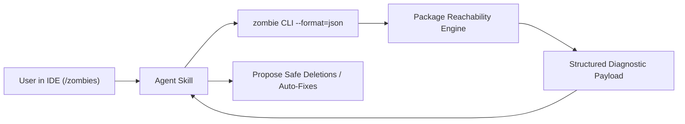

# Product Requirements Document (PRD): `pkg:undead`

## 1. Executive Summary & Vision

**Mission**: Provide a fast, token-efficient, deterministic tool to detect and eliminate **"zombie code"** across Dart packages.

For the exact classification rules, definitions, and code examples, see [taxonomy.md](taxonomy.md).
For Phase 2/3 internal class members and enum pruning, see [taxonomy_phase2.md](taxonomy_phase2.md).

---

## 2. User Scenarios & Personas

### 2.1 Primary User Flow: Agent-First (`/zombies`)
* **Trigger**: Developer types `/zombies` (or runs the `zombie` skill) in their IDE agent (Jetski, Claude Code, Gemini CLI, Cursor).
* **Execution**: The agent invokes the `zombie` CLI against the target codebase.
* **Token Efficiency**: The tool returns a structured, minimal-token representation so the agent can quickly inspect findings, propose deletions/refactors, and remediate dead code without blowing context limits.
* **Output Modes**:
  * **JSON (`--format=json`)**: Machine-readable structured payload for agent parsing and programmatic workflows.
  * **Markdown (`--format=markdown` / `github`)**: Scannable, human-readable tables with clickable file links and line numbers.



---

## 3. Target Scoping & Directory Invariants

### 3.1 Package Directory Topologies & Roots

`pkg:undead` indexes and traverses the complete standard Dart package layout:

<!-- mdformat off(prevent table wrapping) -->
| Directory | Role in Reachability Graph | Root Definition & Invariant |
| :--- | :--- | :--- |
| **`lib/**`** (non-`src`) | **Public API Interface** | All exported symbols (`libraryElement.exportNamespace.definedNames`) are **Public API Roots**. |
| **`lib/src/**`** | **Internal Implementation Target** | Declarations are live **only** if reached from public exports, executables, tests, tools, or examples. |
| **`bin/**/*.dart`** | **CLIs & Executables** | Top-level `main()` functions are **Executable Roots**. |
| **`test/**`, `integration_test/**`** | **Unit & Integration Tests** | Test files containing `main()` are **Test Roots**. |
| **`example/**`** | **Sample Apps & Pub.dev Demos** | **Demonstration Roots**: Immune from deletion by default (`--example-mode=demonstration`). |
| **`tool/**`, `benchmark/**`, `web/**`** | **Utilities & Web Entrypoints** | Entrypoint scripts containing `main()` are **Auxiliary Roots**. |
<!-- mdformat on -->

---

### 3.2 Target Scoping Modes

<!-- mdformat off(prevent table wrapping) -->
| Priority | Target Scenario | Scope Description | Analysis Boundaries |
| :--- | :--- | :--- | :--- |
| **P0 (MVP / Core)** | **Single Leaf Package** | Directory containing a single `pubspec.yaml`. | Analyzes reachability from public export roots (`lib/**`), executables (`bin/`), tests (`test/`), examples (`example/`), and tools (`tool/`) down to `lib/src/`. |
| **P1 (Workspace Batch)** | **Workspace Batch Mode** | Iterates over all packages defined in a `pubspec.yaml` `workspace: [...]` or Melos. | Runs P0 analysis on each member package independently in a single command invocation. |
| **P2 (Workspace Graph)** | **Closed Workspace Cross-Package Analysis** | Treats the entire workspace/monorepo as a single closed universe. | Analyzes whether exported symbols in internal shared/utility packages (e.g. `packages/shared_utils`) are actually consumed by any sibling package in the workspace. |
| **Non-Goal** | **Single File Analysis** | Running on an isolated `foo.dart`. | **Excluded**: Single-file scope cannot soundly prove package-wide reachability. |
| **Non-Goal** | **Arbitrary Directory** | Non-package source trees (e.g. raw SDK source folders). | **Excluded**: Dart package topology (`pubspec.yaml`, `lib/`, `bin/`, `test/`, `example/`, `tool/`) is a required invariant. |
<!-- mdformat on -->

---

## 4. Output Data Models

### 4.1 JSON Output Model (Agent & Tooling)
Designed for low token overhead and actionable precision, including co-invoked hazard detection:

```json
{
  "version": "0.1.0",
  "package": "my_package",
  "summary": {
    "totalDeclarations": 142,
    "pureUndeads": 2,
    "testedUndeads": 1,
    "coInvokedHazards": 1
  },
  "zombies": [
    {
      "id": "calculateLegacyHash",
      "name": "calculateLegacyHash",
      "kind": "function",
      "file": "lib/src/utils.dart",
      "line": 45,
      "column": 1,
      "length": 19,
      "classification": "pureUndead",
      "suggestedAction": "delete"
    },
    {
      "id": "OldParser",
      "name": "OldParser",
      "kind": "class",
      "file": "lib/src/old_parser.dart",
      "line": 10,
      "column": 7,
      "length": 9,
      "classification": "testedUndead",
      "suggestedAction": "deleteWithOrphanTests",
      "orphanTests": [
        {
          "file": "test/old_parser_test.dart",
          "line": 3,
          "column": 3,
          "description": "OldParser parses correctly",
          "coInvokedHazard": false
        }
      ]
    }
  ]
}
```

### 4.2 Markdown Output Model (Human / Reviewer)
* High-level summary of total scanned declarations vs zombies found.
* Categorized tables:
  * **Pure Zombies** (Safe to delete).
  * **Tested Zombies & Orphan Tests** (Delete implementation + delete associated unit test blocks).
  * **Co-Invoked Test Hazards** (Require manual refactoring).

---

## 5. Phased Delivery Roadmap

<!-- mdformat off(prevent table wrapping) -->
| Phase | Milestone | Scope | Key Rationale & Risk Profile |
| :--- | :--- | :--- | :--- |
| **Phase 1 (MVP)** | **Top-Level Declarations** | Top-level classes, functions, mixins, extensions, extension types, typedefs, and top-level variables in `lib/src/`, `bin/`, `tool/`. | **Highest ROI, Lowest Risk**: Zero polymorphism or subtype dispatch ambiguity. Deleting a dead top-level class safely wipes out all its internal dead members and unused imports in one clean strike. |
| **Phase 2** | **Internal Class & Mixin Members** | Methods, fields, constructors, getters, and setters on unexported classes in `lib/src/`. | **Medium Complexity**: Requires Class Hierarchy Analysis (CHA) to prevent false positives on virtual interface overrides (`implements BaseHandler`). |
| **Phase 3** | **Enum Constants & Positional Pruning** | Enum values (`Status.deprecated`) and positional constructor fields. | **High Subtlety**: Requires verifying Dart 3 pattern match / switch expression exhaustiveness and `.values` array usage. |
<!-- mdformat on -->

---

## 6. CLI Flags & Configuration

```bash
zombie [options] [target_path]
```

<!-- mdformat off(prevent table wrapping) -->
| Flag | Options / Default | Description |
| :--- | :--- | :--- |
| `--format` | `json` \| `markdown` (default: `markdown`) | Output formatting mode for stdout (json for agents/CI, markdown for humans). |
| `--json-output` | `path/to/report.json` | Write machine-readable JSON analysis report to file (recommended for agents & CI). |
| `--example-mode` | `demonstration` (default) \| `strict` \| `skip` | In `demonstration`, code in `example/` is a consumer root and immune from deletion. |
| `--mode` | `library` (default) \| `closed-app` | In `library` (default), all non-`src` `lib/**` exports are preserved as Public API roots (Open-World Invariant). In `closed-app`, unreferenced exports are flagged. |
| `--extra-roots` | `<dir1,dir2>` (default: `""`) | Comma-separated list of additional root/test directories or companion packages to include in analysis. |
| `--pub-get` | `false` (default) \| `true` | Automatically run `dart pub get` (or `flutter pub get`) if `.dart_tool/package_config.json` is missing. |
| `--include-generated` | `false` (default) \| `true` | When false, ignores `*.g.dart`, `*.freezed.dart`. |
| `--fail-on-zombies` | `false` (default) \| `true` | Exit with non-zero status code if any zombie is detected (for CI gates). |
<!-- mdformat on -->
