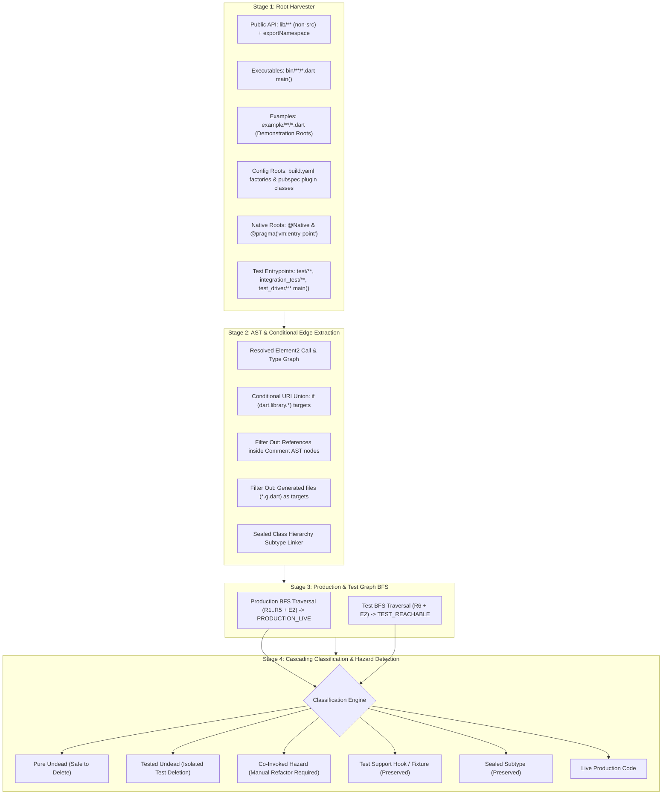

# `pkg:undead`: Phase 1 Taxonomy (Top-Level Declarations)

> [!NOTE]
> This document defines the **Phase 1 (MVP)** scope of `pkg:undead`, focusing strictly on **Top-Level Declarations**.
> For the future Phase 2/3 taxonomy covering internal class members, constructors, and enum constants, see [taxonomy_phase2.md](taxonomy_phase2.md).

---

## 1. Phase 1 Core Scope & Invariants

Phase 1 operates at the **Top-Level AST Declaration** granularity (`CompilationUnit.declarations`):

* **Covered Top-Level Nodes**:
  * Classes (`ClassDeclaration`)
  * Top-level functions (`FunctionDeclaration`)
  * Whole enums (`EnumDeclaration`)
  * Mixins (`MixinDeclaration`)
  * Extensions (`ExtensionDeclaration`)
  * Extension types (`ExtensionTypeDeclaration`)
  * Type aliases / typedefs (`TypeAlias`)
  * Top-level variables and split accessors (`TopLevelVariableDeclaration`, `get`/`set`)
* **Explicitly Deferred to Phase 2/3**:
  * Internal methods, fields, and constructors inside reachable classes.
  * Individual enum constants (`EnumConstantDeclaration`) inside reachable enums.

---

## 2. Directory Roles & Root Invariants

`pkg:undead` partitions directories into **Roots (Consumers)** vs **Analysis Targets (Candidates)**:

<!-- mdformat off(prevent table wrapping) -->
| Directory | Role in Graph | Deletion Target? | Invariant & Reachability Rule |
| :--- | :--- | :---: | :--- |
| **`lib/**`** (non-`src`) | **Public API Root** | ❌ No | **Open-World Invariant**: By default, ALL exported symbols in `exportNamespace` across all non-`src` `lib/**` files are **Public Roots** (Preserved). Never assume `publish_to: none` implies zero external consumers, as internal company repos, path dependencies, and monorepos routinely depend on private packages. |
| **`lib/src/**`** | **Internal Source Target** | ✅ Yes | Declarations are live **only** if reachable from public exports, executables, tests, tools, or examples. |
| **`bin/**/*.dart`** | **Executable Root** | ✅ Yes (Internal) | `main()` functions are roots. Unused top-level helper declarations in `bin/` are deletion candidates. |
| **`test/**`, `integration_test/**`** | **Test Consumer Root** | ❌ No | Test `main()` functions are test roots. Test files are never deletion targets for pure undead. |
| **`example/**`** | **Demonstration Root** | ❌ **No (Immune)** | **Demonstration Invariant**: Code in `example/` is shared on pub.dev for human documentation. It is a consumer root for `lib/src/` and **never a deletion target** by default (`--example-mode=demonstration`). |
| **`tool/**`, `benchmark/**`, `web/**`** | **Auxiliary Consumer Root** | ✅ Yes (Internal) | `main()` functions are roots. Unused internal utilities in `tool/` are deletion candidates. |
| **`*.g.dart`, `*.freezed.dart`** | **Generated Code (Exempt)** | ❌ No | Generated files are never modified or flagged directly. |
<!-- mdformat on -->

---

## 3. Phase 1 Classification Matrix

<!-- mdformat off(prevent table wrapping) -->
| Code Pattern / Declaration | Location | Target Scope | Reachable Production? | Reachable Tests? | Classification | Recommended Action |
| :--- | :--- | :--- | :---: | :---: | :--- | :--- |
| **Unexported Top-Level Declaration** | `lib/src/` | Any | ❌ No | ❌ No | **Pure Undead** | Delete declaration |
| **Tested-Only Isolated Feature** | `lib/src/` | Any | ❌ No | ✅ Yes (Sole Target) | **Tested Undead** | Delete declaration + delete orphan test block |
| **Co-Invoked Tested Declaration** | `lib/src/` | Any | ❌ No | ✅ Yes (Shared Test) | **Co-Invoked Hazard** | Flag `co_invoked_test_hazard` (manual refactor) |
| **Test Support / Fixture / Hook** (`@visibleForTesting`, `Fake*`) | `lib/src/` | Any | ❌ No | ✅ Yes | **Test Support** | Preserve (active test harness) |
| **Exported Symbol in `exportNamespace`** | `lib/**` (excl. `src`) | Any | N/A | N/A | **Public API** | Preserve (Open-World Invariant) |
| **Direct Subtype of Live `sealed` Class** | `lib/src/` | Any | (Hierarchy) | N/A | **Sealed Hierarchy** | Preserve (exhaustiveness guarantee) |
| **Any Declaration in `example/`** | `example/` | Single/Multi | N/A | N/A | **Demonstration Root** | Preserve (pub.dev documentation) |
| **Config Entrypoint** (`build.yaml`, `dartPluginClass`) | `lib/` or `lib/src/` | Any | N/A | N/A | **Config Root** | Preserve |
| **Platform-Conditional Branch** (`if (dart.library.*)`) | `lib/src/` | Any | (Via Web/IO) | N/A | **Platform Live** | Preserve |
| **Foreign / Native Callback** (`@Native`, `@pragma`) | Any | Any | N/A | N/A | **Native Root** | Preserve |
| **Suppressed via Custom Comment** | Any | Any | N/A | N/A | **Ignored** | Skip (`// undead:ignore`) |
<!-- mdformat on -->

---

## 4. Multi-Stage Reachability Engine Pipeline



---

## 5. Concrete Examples & Test Cases

### Example 1: Dead Unexported Top-Level Function (Pure Undead)
```dart
// lib/src/utils.dart (NOT exported in lib/my_package.dart)
String calculateLegacyHash(String input) => input.trim(); // 🧟 PURE UNDEAD
```
* **Analysis**: `calculateLegacyHash` is not in `lib/*.dart` export namespace and has 0 inbound reference edges anywhere in the package.
* **Remediation**: Delete `calculateLegacyHash`.

---

### Example 2: Tested Undead vs Co-Invoked Test Hazard
#### Scenario A: Isolated Tested Undead (Safe to Delete Test Block)
```dart
// lib/src/old_parser.dart (NOT exported in lib/my_package.dart)
class OldParser {
  String parse(String raw) => raw.toLowerCase(); // 🧟 TESTED UNDEAD
}

// test/old_parser_test.dart
void main() {
  test('OldParser parses correctly', () {
    final parser = OldParser();
    expect(parser.parse('FOO'), 'foo'); // ⚠️ Sole reference in test block
  });
}
```
* **Remediation**: Delete `OldParser` and delete the orphan `test('OldParser parses correctly', ...)` block.

#### Scenario B: Co-Invoked Test Hazard (Requires Manual Refactoring)
```dart
// test/integration_pipeline_test.dart
void main() {
  test('pipeline formats output', () {
    final intermediate = OldParser.parse('FOO'); // 🧟 Dead helper
    final result = LivePipeline.process(intermediate); // 🟢 LIVE production class
    expect(result.isValid, isTrue);
  });
}
```
* **Remediation**: Flag as `co_invoked_test_hazard`. Do **NOT** delete the test block automatically; prompt developer to refactor `LivePipeline` test input.

---

### Example 3: Dart 3 Sealed Class Hierarchy (Preserved for Exhaustiveness)
```dart
// lib/src/ast_nodes.dart
sealed class AstNode {}
class LiteralNode extends AstNode {}
class IdentifierNode extends AstNode {}
class UnusedCommentNode extends AstNode {} // 🛡️ Uninstantiated, but needed for switch exhaustiveness!
```
* **Analysis**: `UnusedCommentNode` is a direct subtype of `AstNode`. Removing it would break exhaustive `switch (node)` pattern matches.
* **Remediation**: Preserve (Sealed Hierarchy).

---

### Example 4: Pub.dev Example Code (Demonstration Root)
```dart
// example/example.dart (Shared publicly on pub.dev)
import 'package:my_pkg/my_pkg.dart';

// 💡 Illustrative data model for human readers on pub.dev:
class UserProfile {
  final String username;
  UserProfile(this.username);
}

void main() {
  final client = MyPkgClient();
  client.init();
  // Note: UserProfile is not instantiated in main()!
}
```
* **Analysis**: `UserProfile` is in `example/example.dart`.
* **Remediation**: Preserve (Demonstration Root).

---

### Example 5: Platform-Conditional Branch (Platform Live)
```dart
// lib/src/platform.dart
export 'src/platform_io.dart'
  if (dart.library.js_interop) 'src/platform_web.dart';
```
* **Analysis**: On a VM analysis host, `platform_web.dart` is conditionally imported for web targets.
* **Remediation**: The AST parser unions conditional branches; declarations in `platform_web.dart` are preserved as Platform Live.

---

## 6. Custom Comment Suppression Syntax

> [!IMPORTANT]
> **Anti-Collision Rule**: We must **NOT** co-opt Dart's standard `// ignore: ...` or `// ignore_for_file: ...` syntax.
> The Dart analyzer treats unrecognized lint codes in `// ignore:` as diagnostic errors (`unrecognized_error_code`).

<!-- mdformat off(prevent table wrapping) -->
| Directive | Scope | Example Usage |
| :--- | :--- | :--- |
| `// undead:ignore` | Suppresses the immediately following top-level declaration | `// undead:ignore`<br>`class DynamicPluginTarget { ... }` |
| `// undead:ignore_for_file` | Suppresses all undead findings within the current `.dart` file | Top of file:<br>`// undead:ignore_for_file` |
<!-- mdformat on -->
