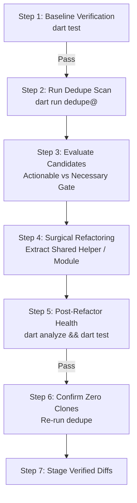

# Dart Dedupe (`dart-dedupe`)

High-performance structural code duplication and clone detection engine and
refactoring protocol for Dart and Flutter repositories using `pkg:dedupe`.

--------------------------------------------------------------------------------

## 1. When to Use This Skill

Use this skill when auditing codebase redundancy, identifying copy-paste
blocks, preventing duplication regressions in pull requests, or evaluating
shared utility and abstraction candidates across Dart packages.

Unlike basic lexical diffs, `dedupe` tokenizes and analyzes Dart source code to
detect:
* **Identical Clones**: Exact token-for-token copies across files.
* **Structural Clones**: Clones matching after normalizing string literals and
  numeric constants (`--ignore-literals`).
* **Parameterized Clones**: Clones matching after normalizing variable and type
  identifiers (`--ignore-identifiers`).

### Trigger Indicators
* **Copy-pasted utilities**: Identical or nearly identical helper functions
  duplicated across multiple files or classes.
* **Redundant serialization / parsing**: Repeated manual JSON decoders, record
  mappers, or data transformation pipelines.
* **PR / CL Duplication Regressions**: Catching newly introduced duplicate
  code before merging pull requests.

### When NOT to Use
* **Single-File Private Variable Lints**: Use standard `dart analyze` for simple
  unused variables or parameters.
* **Code Formatting**: Use `dart format`.
* **Non-Dart Projects**: Tool operates strictly on Dart syntax.

--------------------------------------------------------------------------------

## 2. Automated Execution & Scope Resolution

Run the official package CLI directly:

```bash
dart run dedupe@ [options] [target_path]
```

### Execution Modes

#### Mode 1: Full Repository / Directory Scan
```bash
# Markdown summary with clickable file links
dart run dedupe@

# Machine-readable JSON output for agent pipelines
dart run dedupe@ --format=json

# Write JSON report to file alongside human stdout
dart run dedupe@ --json-output=report.json
```

#### Mode 2: PR / Git Diff Delta Scan (`--git-diff`)
Focus strictly on code modified in a branch or PR:

```bash
# In Git checkouts:
dart run dedupe@ --git-diff=origin/main

# Filter report strictly to clusters intersecting modified lines:
dart run dedupe@ --git-diff=origin/main --only-changed

# Fail CI if diff duplication exceeds 5%:
dart run dedupe@ --git-diff=origin/main --fail-threshold=5
```

### Common CLI Options Reference

<!-- mdformat off(prevent table wrapping) -->

| Option / Flag | Purpose | Default |
| :--- | :--- | :--- |
| `-k, --min-tokens` | Minimum token count for a reported duplicate block. | `40` |
| `-l, --min-lines` | Minimum line count for a reported duplicate block. | `4` |
| `--[no-]ignore-comments` | Ignore comments when comparing tokens. | `true` |
| `--[no-]ignore-literals` | Normalize literals to detect structural clones. | `true` |
| `--[no-]ignore-identifiers` | Normalize identifiers to detect parameterized clones. | `false` |
| `--category` | Filter clusters (`all`, `logic`, `data`, `boilerplate`). | `all` |
| `--bucket` | Filter clusters (`all`, `identical`, `structural`, `parameterized`). | `all` |
| `--top` | Limit number of top clusters to display (`0` for all). | `0` |
| `-f, --fail-threshold` | Maximum allowed duplication percentage before failing. | None |
| `-d, --git-diff` | Git reference to compare against (e.g. `origin/main`). | None |
| `--only-changed` | Only report clusters intersecting modified lines. | `false` |
| `--format` | Output format (`markdown`, `json`, `github`, `text`). | `markdown` |
| `--json-output` | File path to write machine-readable JSON report. | None |

<!-- mdformat on -->

--------------------------------------------------------------------------------

## 3. The "Actionable vs. Necessary" Architectural Gate

**Do not treat every duplicate finding as a mandatory refactoring target.**
Evaluate each candidate cluster before modifying code:

### ✅ Actionable Duplication (Refactor & Extract)
* **Copy-pasted helpers or decoders:** Identical algorithms, database record
  parsers, or conversion utilities scattered across multiple classes or files.
* **Shared contract declarations:** Common `typedef` contracts, data models, or
  record shapes duplicated across platform stubs (extract to a shared library).
* **Repetitive CLI orchestration:** Copy-pasted external process invocations or
  JSON decoding blocks where schema updates would risk drift.
* **Code generator scaffolding:** Repetitive string builders or verbose AST
  instantiations that can be cleanly condensed into parameterized emitters.

### 🛑 Necessary Duplication (Reject Refactoring & Preserve)
* **Type-unsafe polymorphic AST targets:** When similar-looking classes (such as
  AST statement variants) do not share a common type interface. Using `dynamic`
  sacrifices compile-time type safety for negligible line reduction.
* **Performance-critical specialized solver loops:** Symmetric horizontal vs.
  vertical grid traversals where unifying orthogonal strides into a single
  abstraction would require allocating closures or virtual calls in tight loops.
* **Speculative wrapping of standalone entry points:** Abstracting trivial
  4-to-6 line `try/catch` fallback formatting across unrelated standalone CLI
  entry points (`bin/<script>.dart`).
* **DAMP Test Boilerplate:** Repetitive setup structures in table-driven unit tests.

--------------------------------------------------------------------------------

## 4. Pre & Post Refactor Verification Protocol

Wrap all deduplication refactoring in a strict verification sandwich:



1. **Verify Baseline:** Run `dart test` prior to modification. Ensure 100% pass.
2. **Surgical Modification:** Extract shared functions or helper classes cleanly.
3. **Verify Post-Refactor Health:** Run `dart analyze --fatal-infos` and `dart test`.
4. **Zero-Clone Confirmation:** Re-run `dart run dedupe@` to confirm the target
   cluster was eliminated.
5. **Local Staging:** Stage verified diffs locally (`git add .`).

--------------------------------------------------------------------------------

## 5. Pull Request & Commit Provenance Protocol

When staging deduplicated code and preparing a commit message or Pull Request:

### 1. Standardized Provenance Block Format
Append the following markdown block to the PR description or commit body:

````markdown
### 🤖 Tool Provenance & Reproduction

Structural duplication analysis performed with [`dedupe`](https://pub.dev/packages/dedupe) (`v{version}`).

To reproduce or re-run this duplication scan locally:
```bash
{exact_command_line}
```
````

### 2. Version Resolution
Determine the package version dynamically:
* Check `pubspec.lock` in the workspace or run `dart run dedupe@ --version`.
