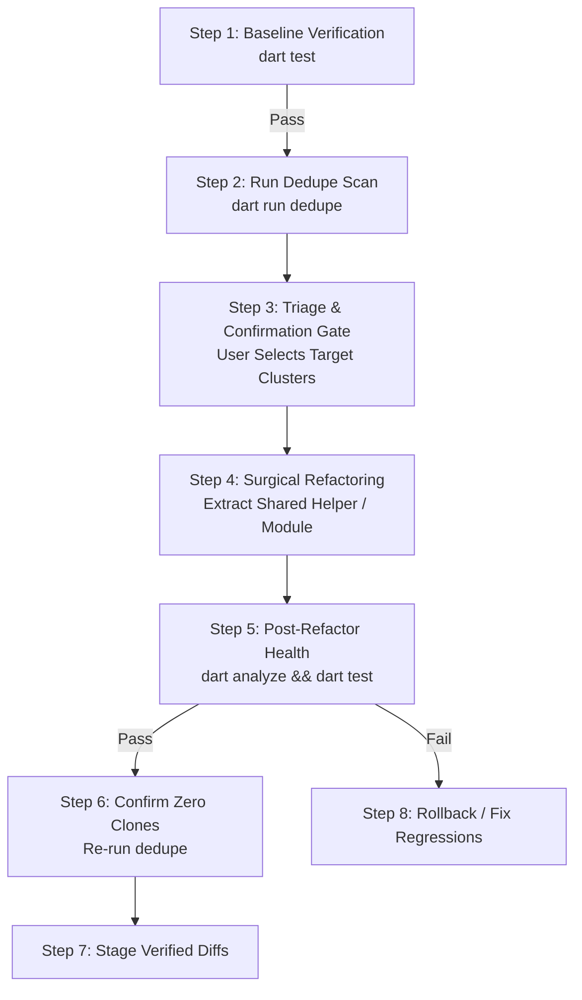

# Dart Dedupe (`dart-dedupe`)

High-performance structural code duplication and clone detection engine and
refactoring protocol for Dart and Flutter repositories using `pkg:dedupe`.

---

## 1. When to Use This Skill

Use this skill when auditing codebase redundancy, identifying copy-paste blocks,
preventing duplication regressions in pull requests, or evaluating shared
utility and abstraction candidates across Dart packages.

Unlike basic lexical diffs, `dedupe` tokenizes and analyzes Dart source code to
detect:

- **Identical Clones**: Exact token-for-token copies across files.
- **Structural Clones**: Clones matching after normalizing string literals and
  numeric constants (`--ignore-literals`).
- **Parameterized Clones**: Clones matching after normalizing variable and type
  identifiers (`--ignore-identifiers`).
- **Gapped / Near-Miss Clones**: Type-3 clones matching with internal statement
  insertions, deletions, or edits via MinHash & LSH shingling
  (`--bucket=gapped`).

### Trigger Indicators

- **Copy-pasted utilities**: Identical or nearly identical helper functions
  duplicated across multiple files or classes.
- **Redundant serialization / parsing**: Repeated manual JSON decoders, record
  mappers, or data transformation pipelines.
- **PR / CL Duplication Regressions**: Catching newly introduced duplicate code
  before merging pull requests.

### When NOT to Use

- **Single-File Private Variable Lints**: Use standard `dart analyze` for simple
  unused variables or parameters.
- **Code Formatting**: Use `dart format`.
- **Non-Dart Projects**: Tool operates strictly on Dart syntax.

---

## 2. Automated Execution & Scope Resolution

Run the official package CLI directly:

```bash
dart run dedupe@^0.1.0 [options] [target_path]
```

### Execution Modes

#### Mode 1: Full Repository / Directory Scan

```bash
# Markdown summary with clickable file links
dart run dedupe@^0.1.0

# Machine-readable JSON output for agent pipelines
dart run dedupe@^0.1.0 --format=json

# Write JSON report to file alongside human stdout
dart run dedupe@^0.1.0 --json-output=report.json
```

#### Mode 2: PR / Git Diff Delta Scan (`--git-diff`)

Focus strictly on code modified in a branch or PR:

```bash
# In Git checkouts:
dart run dedupe@^0.1.0 --git-diff=origin/main

# Filter report strictly to clusters intersecting modified lines:
dart run dedupe@^0.1.0 --git-diff=origin/main --only-changed

# Fail CI if diff duplication exceeds 5%:
dart run dedupe@^0.1.0 --git-diff=origin/main --fail-threshold=5
```

### Common CLI Options Reference

<!-- mdformat off(prevent table wrapping) -->

| Option / Flag               | Purpose                                                                        | Default             |
| :-------------------------- | :----------------------------------------------------------------------------- | :------------------ |
| `-k, --min-tokens`          | Minimum token count for a reported duplicate block.                            | `40`                |
| `-l, --min-lines`           | Minimum line count for a reported duplicate block.                             | `4`                 |
| `--[no-]ignore-comments`    | Ignore comments when comparing tokens.                                         | `true`              |
| `--[no-]ignore-literals`    | Normalize literals to detect structural clones.                                | `true`              |
| `--[no-]ignore-identifiers` | Normalize identifiers to detect parameterized clones.                          | `false`             |
| `--category`                | Filter clusters (`all`, `logic`, `data`, `boilerplate`).                       | `all`               |
| `--bucket`                  | Filter clusters (`all`, `identical`, `structural`, `parameterized`, `gapped`). | `all`               |
| `--top`                     | Limit number of top clusters to display (`0` for all).                         | `0`                 |
| `-f, --fail-threshold`      | Maximum allowed duplication percentage before failing.                         | None                |
| `-d, --git-diff`            | Git reference to compare against (e.g. `origin/main`).                         | None                |
| `--only-changed`            | Only report clusters intersecting modified lines.                              | `false`             |
| `--exclude`                 | Comma-separated glob patterns of files to exclude.                             | Standard exclusions |
| `--include`                 | Comma-separated glob patterns of files to include.                             | `**/*.dart`         |
| `--[no-]cache`              | Enable on-disk caching of AST candidates & token sequences.                    | `true`              |
| `--cache-dir`               | Custom directory for cache (defaults to `.dart_tool/dedupe`).                  | None                |
| `--[no-]files`              | Include per-file duplication metrics table in report.                          | `true`              |
| `--[no-]clusters`           | Include duplicate clusters list in report.                                     | `true`              |
| `--format`                  | Output format (`markdown`, `json`, `github`, `text`).                          | `markdown`          |
| `--json-output`             | File path to write machine-readable JSON report.                               | None                |

<!-- mdformat on -->

---

## 3. The "Actionable vs. Necessary" Architectural Gate

**Do not treat every duplicate finding as a mandatory refactoring target.**
Evaluate each candidate cluster before modifying code:

### ✅ Actionable Duplication (Refactor & Extract)

- **Copy-pasted helpers or decoders:** Identical algorithms, database record
  parsers, or conversion utilities scattered across multiple classes or files.
- **Shared contract declarations:** Common `typedef` contracts, data models, or
  record shapes duplicated across platform stubs (extract to a shared library).
- **Repetitive CLI orchestration:** Copy-pasted external process invocations or
  JSON decoding blocks where schema updates would risk drift.
- **Code generator scaffolding:** Repetitive string builders or verbose AST
  instantiations that can be cleanly condensed into parameterized emitters.

### 🛑 Necessary Duplication (Reject Refactoring & Preserve)

- **Type-unsafe polymorphic AST targets:** When similar-looking classes (such as
  AST statement variants) do not share a common type interface. Using `dynamic`
  sacrifices compile-time type safety for negligible line reduction.
- **Performance-critical specialized solver loops:** Symmetric horizontal vs.
  vertical grid traversals where unifying orthogonal strides into a single
  abstraction would require allocating closures or virtual calls in tight loops.
- **Speculative wrapping of standalone entry points:** Abstracting trivial
  4-to-6 line `try/catch` fallback formatting across unrelated standalone CLI
  entry points (`bin/<script>.dart`).
- **DAMP Test Boilerplate:** Repetitive setup structures in table-driven unit
  tests.

---

## 4. The 2-Stage Triage & Confirmation Protocol

To prevent unwanted diff bloat and preserve codebase stability, adhere to this
strict 2-stage workflow:

### Stage 1: Read-Only Audit & Reporting (Mandatory Stop)

Run `dart run dedupe --format=markdown` (or `--format=json`).

Output a ranked **Duplication Triage Report** containing:

1. **Target Summary**: Files analyzed, total lines, duplication percentage, and
   estimated lines saved.
2. **Top Duplicate Clusters**: Clickable file links, line ranges, token counts,
   clone classification category (`logic`, `data`, `boilerplate`), and bucket
   (`identical`, `structural`, `parameterized`, `gapped`).
3. **Actionability Annotations**: Highlight recommended extraction strategy or
   mark as "Necessary Duplication (Preserve)".

### Stage 2: Interactive User Confirmation Gate

Pause execution and prompt the user (via interactive choice or chat) to select
the desired remediation scope:

1. **(Recommended) Refactor Top Actionable Cluster Only**: Target the single
   highest-impact duplicate helper or decoder.
2. **Refactor All Actionable Clusters in Scope**: Sequentially extract all
   approved duplicate blocks.
3. **Report-Only / Exit**: Acknowledge findings without code mutations.

---

## 5. Pre & Post Refactor Verification Protocol

Wrap all deduplication refactoring in a strict verification sandwich:



1. **Verify Baseline:** Run `dart test` prior to modification. Ensure 100% pass.
2. **Surgical Modification:** Extract shared functions or helper classes
   cleanly.
3. **Verify Post-Refactor Health:** Run `dart analyze --fatal-infos` and
   `dart test`.
4. **Zero-Clone Confirmation:** Re-run `dart run dedupe` to confirm the target
   cluster was eliminated.
5. **Local Staging:** Stage verified diffs locally (`git add .`).

---

## 6. Pull Request & Commit Provenance Protocol

When staging deduplicated code and preparing a commit message or Pull Request:

### 1. User Confirmation Gate & Headless Defaults

- **Interactive Sessions**: Before writing the PR description or commit body,
  explicitly prompt the user in chat or via the harness confirmation tool (e.g.
  `ask_question`) whether to include a **Tool Provenance & Reproduction block**.
- **Headless / Autonomous Fallback**: In non-interactive contexts (e.g.
  subagents, automated eval suites like `evalin`, or headless CI), default to
  including the block automatically without blocking on user confirmation.

### 2. Standardized Provenance Block Format

When confirmed (or running headlessly), append the following markdown block to
the PR description or commit body:

````markdown
### 🤖 Tool Provenance & Reproduction

Structural duplication analysis performed with
[`dedupe`](https://pub.dev/packages/dedupe) (`v{version}`).

To reproduce or re-run this duplication scan locally:

```bash
{exact_command_line}
```
````

### 3. Version Resolution

Determine the package version dynamically:

- Check `pubspec.lock` in the workspace or run `dart run dedupe --version`.
