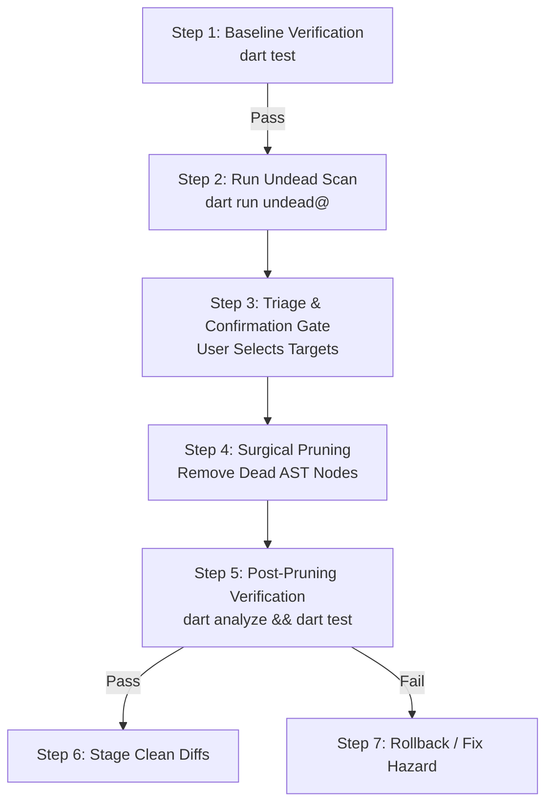

# Dart Undead (`dart-undead`)

Deterministic reachability and dead/unused declaration analysis for Dart and
Flutter packages using `pkg:undead`.

---

## 1. When to Use This Skill

Use this skill when auditing codebase health, trimming dead weight from mature
packages, identifying orphaned internal abstractions, or cleaning up standalone
applications and CLI tools.

Unlike basic lexical lints (`unused_element`, `unused_field`) which only detect
unused file-private (`_`) identifiers, `undead` builds a whole-package
reachability graph from designated entrypoint roots down to all internal
declarations.

### Trigger Indicators

- **Orphaned Internal Utilities**: Functions, classes, or mixins under
  `lib/src/` unreachable from public API barrels or internal entrypoints.
- **Dead Application Features**: Unreachable views, controllers, or services in
  standalone CLI tools or Flutter apps.
- **Orphaned Test Fixtures**: Dead `Fake*` or `Mock*` fixtures left behind after
  features were refactored.
- **Pre-Release API Pruning**: Verifying whether newly introduced experimental
  helpers are actually wired up before public release.

### When NOT to Use

- **Single-File Private Lints**: Rely on standard `dart analyze` for simple
  local variable or private parameter lints.
- **Code Formatting or Lint Rules**: Use standard `dart format` or `dart fix`.
- **Non-Dart / Non-Flutter Projects**: Tool exclusively operates on Dart ASTs.

---

## 2. Automated Execution & Scope Resolution

Execute the official package CLI directly in the terminal to retrieve
reachability findings deterministically:

```bash
dart run undead@^0.1.1 [options] [target_path]
```

> [!NOTE] **Pre-Flight Package Resolution Gate**: `package:analyzer` requires
> `.dart_tool/package_config.json` to resolve `package:<name>/...` imports. If
> packages are unresolved, pass `--pub-get` to automatically run `dart pub get`
> or `flutter pub get`. If encountering `.dart_tool` atomic rename errors in
> sandboxed environments, pass `--no-precompile` (e.g.
> `dart run --no-precompile undead@^0.1.1`).

### Execution Modes

#### Mode 1: Library Package (Default / Open-World)

Preserves all non-`src` `lib/**` exports as public API roots. Analyzes whether
internal declarations (`lib/src/**`) are reachable from exported barrels or
tests:

```bash
# Markdown output for human review
dart run undead@^0.1.1

# Machine-readable JSON output for agent automation
dart run undead@^0.1.1 --format=json
```

#### Mode 2: Closed Application (`--mode=closed-app`)

Traces execution strictly from executable entrypoints (`bin/**`,
`lib/main.dart`, `lib/main_*.dart`). Treats unreferenced public declarations as
dead:

```bash
dart run undead@^0.1.1 --mode=closed-app
```

#### Mode 3: Example Code Handling (`--example-mode`)

Controls how code in `example/` is treated during reachability analysis:

- `demonstration` (Default): `example/` code is treated as a consumer root;
  example files are never suggested for deletion.
- `strict`: Analyzes reachability within `example/` itself.
- `skip`: Ignores `example/` completely during analysis.

```bash
dart run undead@ --example-mode=demonstration
```

### Common CLI Options Reference

| Option / Flag                     | Purpose                                                           | Default         |
| :-------------------------------- | :---------------------------------------------------------------- | :-------------- |
| `-m, --mode`                      | Analysis mode (`library` or `closed-app`).                        | `library`       |
| `-f, --format`                    | Output formatting (`markdown`, `json`, `github`).                 | `markdown`      |
| `--json-output=<path>`            | Write JSON report to file while preserving stdout.                | None            |
| `--example-mode`                  | Policy for `example/` (`demonstration`, `strict`, `skip`).        | `demonstration` |
| `--extra-roots=<dir1,dir2>`       | Comma-separated list of additional root/test dirs.                | `""`            |
| `--test-support-patterns`         | Comma-separated wildcards for test fixtures.                      | `Fake*,Mock*`   |
| `--ignore-name-patterns`          | Comma-separated wildcards for names to ignore.                    | `""`            |
| `--[no-]workspace-discovery`      | Discover consumer roots from sibling packages in workspace.       | `true`          |
| `--[no-]ignore-external-bindings` | Preserve unreferenced `@JS()` and FFI facades.                    | `false`         |
| `--[no-]suggest-private`          | Identify top-level declarations that can be made library-private. | `false`         |
| `--pub-get`                       | Auto-run `dart pub get` / `flutter pub get` if needed.            | `false`         |
| `--fail-on-undead`                | Exit with non-zero code (1) on findings (useful for CI).          | `false`         |

---

## 3. Critical Safety Guardrails & Deletion Invariants

> [!CAUTION] **Audit Before Deleting**: Never delete declarations autonomously
> without reviewing safety invariants and verifying against the test suite.

### Invariant 1: Sealed Class Hierarchy Protection

Direct subtypes of live `sealed` classes (via `extends`, `implements`, `with`,
or `enum`) must **NEVER** be deleted, even if unreferenced elsewhere. Deleting a
sealed subtype breaks Dart 3 exhaustive pattern matching across all `switch`
expressions.

### Invariant 2: Co-Invoked Test Hazard Protection

When a test file invokes both live and dead declarations:

- **Isolated Dead Tests**: Test blocks referencing _only_ dead code can be
  safely pruned alongside the dead target.
- **Co-Invoked Test Hazard**: When a single test function or widget test
  exercises both live and dead code, **do not delete the test**. Refactor the
  test body to remove only the dead assertions.

### Invariant 3: Framework Entrypoints & Pragmas

Ensure framework-specific roots are not falsely classified as dead:

- **Build Runner**: Builder factories and generator entrypoints in `build.yaml`.
- **VM Entrypoints**: Declarations annotated with `@pragma('vm:entry-point')`.
- **JS Interop**: External JavaScript facades (`@JS()`). Pass
  `--ignore-external-bindings` if pruning libraries with public interop headers.

### Invariant 4: Custom Suppression Syntax

To suppress intentional dead code or API placeholders without deleting:

- **Declaration Level**: `// undead:ignore` (placed directly above declaration).
- **File Level**: `// undead:ignore_for_file` (placed at top of file).
- _(Note: Never use `// ignore: ...` as the Dart analyzer treats unknown lint
  codes as errors)._

### Invariant 5: Monorepo & External Entrypoint Protection

In monorepos with multiple inter-dependent packages (e.g. `pkgs/test` wrapping
`pkgs/test_core`), some declarations in `lib/src/` (such as `runTests` in
`executable.dart`) serve as execution entrypoints invoked by sibling packages or
top-level executables.
- Check if the target package is consumed by parent/sibling packages in the
  workspace before deleting top-level `lib/src/` functions.
- If an unexported function is an intended external entrypoint, protect it with
  `// ignore: unreachable_from_main` or `// undead:ignore`.

### Invariant 6: Holistic Pruning Mandate (No Trivial-Only Edits)

When pruning dead code, do not settle for trivial bookkeeping (like deleting a
few unused exit codes while leaving entire unreferenced subsystems intact).
- Delete all verified pure dead classes, functions, and files in `lib/src/`
  (e.g., dead listeners, obsolete runner scaffolds) in one cohesive pass.
- Remove orphaned imports, associated dead private helpers, and obsolete test
  fixtures concurrently.

---

## 4. The 2-Stage Triage & Confirmation Protocol

To prevent accidental deletions of public APIs or breaking downstream consumers,
follow this strict 2-stage workflow:

### Stage 1: Read-Only Audit & Reporting (Mandatory Stop)

Run `dart run undead@ --format=markdown` (or `--format=json`).

Output a ranked **Dead Code Triage Report** containing:

1. **Target Summary**: Package name, analysis mode (`library` vs `closed-app`),
   and total undead declarations detected.
2. **Actionable Findings Table**: Clickable file link, line number, declaration
   type (`class`, `function`, `method`, `variable`), and name.
3. **Safety Annotations**: Highlight any `sealed` subtypes, co-invoked test
   hazards, or public exports.

### Stage 2: Interactive User Confirmation Gate

Pause execution and prompt the user (via interactive choice or chat) to select
the desired remediation scope:

1. **(Recommended) Prune All Verified Dead Subsystems & Files**: Concurrently
   delete all unreferenced internal classes, functions, and files in
   `lib/src/**` and isolated dead test files.
2. **Prune Application Entrypoints**: Target dead features in a closed app
   (`--mode=closed-app`).
3. **Suppress Findings**: Add `// undead:ignore` comments to intentional
   placeholders.
4. **Report-Only / Exit**: Acknowledge findings without code mutations.

---

## 5. Pre & Post Deletion Verification Protocol

Always wrap code deletions in a strict test and analysis sandwich:



1. **Pre-Flight Baseline**: Execute `dart test` to confirm the test suite is
   100% green before touching any code.
2. **Surgical Deletion**: Remove the flagged declaration and any orphaned
   imports associated with it.
3. **Post-Flight Verification**:
   - Run `dart analyze` to ensure zero compilation or unresolved reference
     errors.
   - Run `dart test` to confirm all remaining tests pass.
4. **Clean Diff Staging**: Inspect modifications using `git diff --stat` (or
   isolate in a temporary feature branch/worktree) to ensure only intended
   declarations were removed.

---

## 6. Pull Request & Commit Provenance Protocol

When staging pruned code and preparing a commit message or Pull Request:

### 1. User Confirmation Gate & Headless Defaults

- **Interactive Sessions**: Before writing the PR description or commit body,
  explicitly prompt the user in chat or via the harness confirmation tool (e.g.
  `ask_question`) whether to include a **Tool Provenance & Reproduction block**.
- **Headless / Autonomous Fallback**: In non-interactive contexts (e.g.
  subagents, automated eval suites like `evalin`, or headless CI), default to
  including the block automatically without blocking on user confirmation.

### 2. Standardized Provenance Block Format

When confirmed (or running headlessly), append the following markdown block to
the PR description or commit body so reviewers understand where the deletions
originated and can rerun the reachability analysis locally:

````markdown
### 🤖 Tool Provenance & Reproduction

Dead code detection and reachability analysis performed with
[`undead`](https://pub.dev/packages/undead) (`v{version}`).

To reproduce or re-run this reachability audit locally:

```bash
{exact_command_line}
```
````

### 3. Version Resolution

Determine the package version dynamically:

- Check `pubspec.lock` in the workspace or run `dart run undead@ --version`.
- If invoked with a specific version constraint (e.g. `undead@0.1.0`), use that
  exact version.
